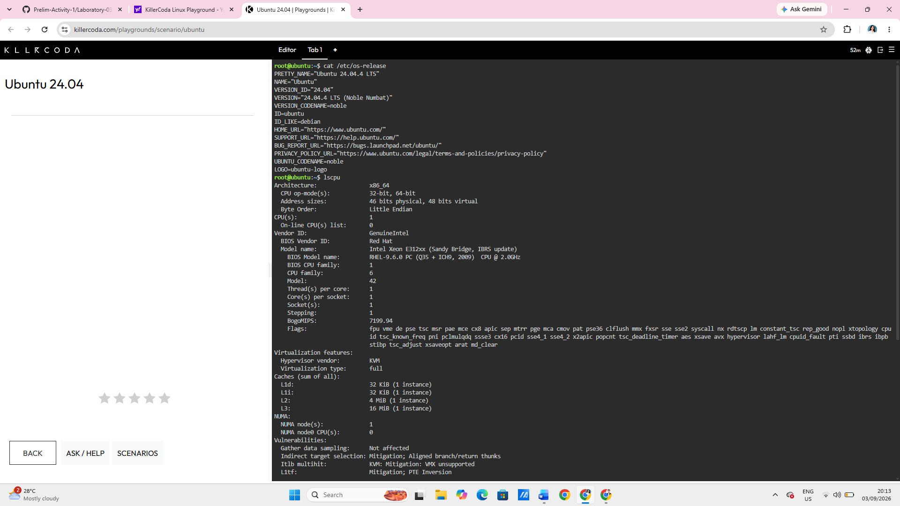
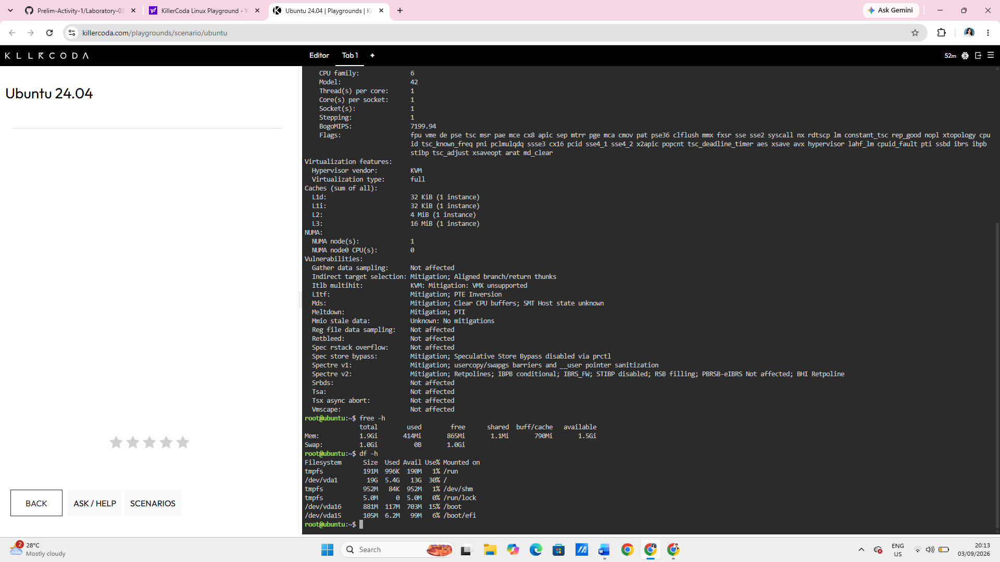

# Laboratory 03 – Multi-Cloud Explorer
## Checkpoint 7 – Linux Investigation

### Linux Server Information

- **Operating System:** Ubuntu 24.04.4 LTS
- **CPU Information:** Intel Xeon E312xx (Sandy Bridge, IBRS update)
- **Memory:** 1.9 GiB
- **Disk Space:** 19G total, 13G available

### Cloud Services That Could Host the Linux Server

- **AWS:** Amazon EC2
- **Microsoft Azure:** Azure Virtual Machines
- **Google Cloud Platform:** Compute Engine

These cloud services can host Linux-based virtual machines and provide configurable computing resources such as CPU, memory, storage, and operating system options.

### Terminal Output

