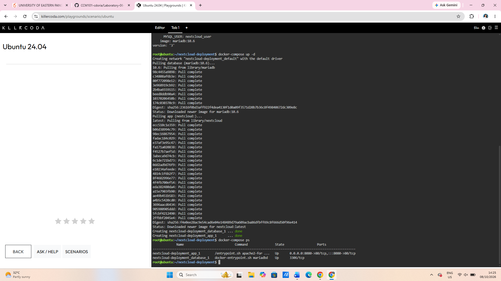
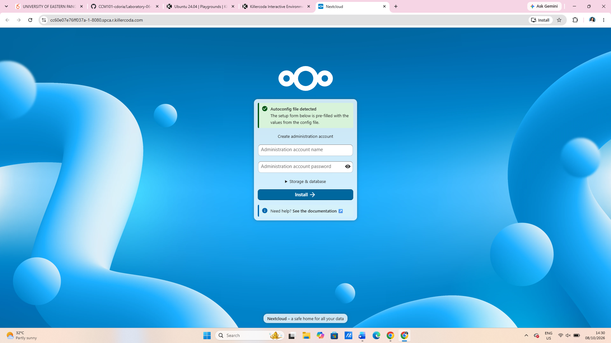
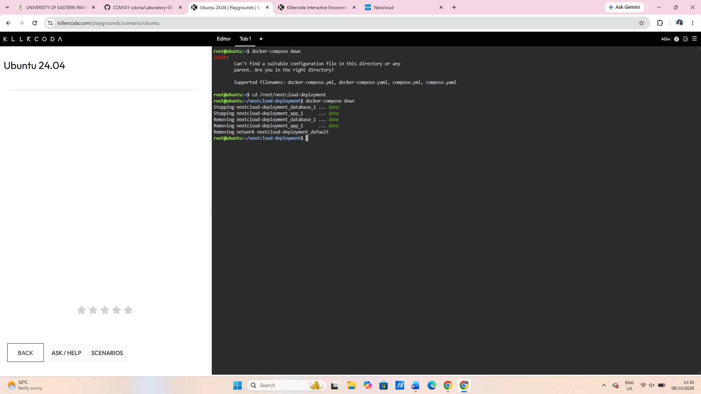

# Docker Compose Guide

## Mission 6: The Cloud Deployment Engineer

### Introduction

Docker Compose is a tool that allows multiple containers to be configured and managed using a single YAML file. In this laboratory activity, Docker Compose was used to deploy a two-tier private cloud storage application consisting of Nextcloud and MariaDB.

Instead of creating and connecting each container manually, the required services were defined inside a `docker-compose.yml` file and started using one command.

## 1. What Does the `services:` Block Do?

The `services:` block defines the containers that Docker Compose needs to create and manage. Each service contains configuration settings, such as the Docker image, environment variables, and port mappings.

In this activity, two services were defined:

- **database:** Uses the `mariadb:10.6` image to store Nextcloud's database information, including user accounts, application settings, and file metadata.
- **app:** Uses the `nextcloud` image to provide the cloud storage web application. It maps port `8080` on the host to port `80` inside the container.

These two services allow the application and database to operate in separate containers while communicating through the same Docker Compose network.

## 2. How Does Nextcloud Find the Database Container?

The Nextcloud container connects to MariaDB using the `MYSQL_HOST=database` environment variable.

The value `database` refers to the database service name declared in the `docker-compose.yml` file. Docker Compose creates a default network that allows the containers to communicate using their service names.

The `MYSQL_DATABASE`, `MYSQL_USER`, and `MYSQL_PASSWORD` environment variables provide the database name and credentials needed by Nextcloud.

Because of this configuration, Nextcloud can locate the database container without manually specifying its IP address.

## 3. Difference Between `docker run` and `docker-compose up -d`

The `docker run` command creates and starts a container using settings provided directly in the command line. When deploying multiple containers, separate commands and additional configuration may be needed.

On the other hand, `docker-compose up -d` reads the `docker-compose.yml` file and creates or starts all defined services together. The `-d` option runs the containers in detached mode, allowing them to continue running in the background.

For this laboratory activity, Docker Compose made deployment easier because Nextcloud and MariaDB could be launched and connected through one configuration file and one deployment command.

## 4. Deployment Commands Used

The following commands were used during the activity:

| Command | Purpose |
|---|---|
| `mkdir nextcloud-deployment` | Creates the project directory. |
| `cd nextcloud-deployment` | Opens the project directory. |
| `nano docker-compose.yml` | Creates and edits the Docker Compose configuration file. |
| `cat docker-compose.yml` | Displays the YAML configuration. |
| `docker-compose --version` | Checks the installed Docker Compose version. |
| `docker-compose config` | Validates the Docker Compose configuration. |
| `docker-compose up -d` | Deploys the Nextcloud and MariaDB containers in the background. |
| `docker-compose ps` | Displays the status of the deployed containers. |
| `docker-compose down` | Stops and removes the containers and their default Compose network. |

## 5. Deployment Results

The deployment was completed using the KillerCoda Ubuntu 24.04 Playground.

After running `docker-compose up -d`, both the Nextcloud application container and the MariaDB database container were created successfully. The `docker-compose ps` command confirmed that both containers were running.

Nextcloud was accessed through port `8080`, and its administration account setup page appeared in the web browser. As instructed, the installation process was not completed.

Finally, `docker-compose down` successfully stopped and removed the containers and their Docker Compose network.

## 6. Screenshot Evidence

### Successful Docker Compose Deployment

### Nextcloud Installation Page

### Successful Container Teardown

## Conclusion

This activity demonstrated how Docker Compose can simplify the deployment and management of a multi-container application. By using a YAML configuration file, Nextcloud and MariaDB were configured, deployed, verified, and removed using a consistent set of commands.

The experience also demonstrated the importance of Infrastructure as Code in organizing and managing cloud application deployments.
